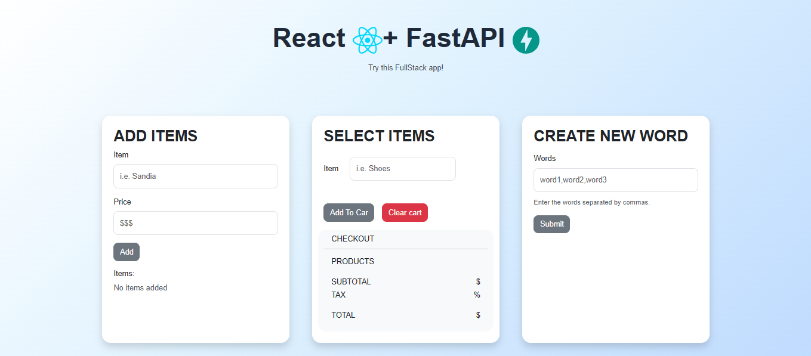

# Fullstack React + FastAPI Project

## 📌 Description

This project is a fullstack web application built with FastAPI and React. It implements three backend services (dictionary management, cart system, and word construction) and includes Docker containerization and CI/CD with GitHub Actions.

---

## 📸 Screenshots

### Dashboard Overview



---


## 🛠 Tech Stack

- Backend: FastAPI, Python
- Frontend: React, JavaScript, Bootstrap
- Testing: Pytest
- DevOps: Docker, Docker Compose, GitHub Actions

---

## 📁 Project Structure

```text
project-root/
│
├── .github/workflows/cicd.yml
│
├── backend/
│   ├── app/
│   │   ├── routes/store_routes.py
│   │   ├── schemas/store_schema.py
│   │   ├── scripts/
│   │   │   ├── task1.py
│   │   │   ├── task2.py
│   │   │   └── task3.py
│   │   ├── services/store_service.py
│   │   └── main.py
│   ├── tests/test_services.py
│   ├── .dockerignore
│   ├── Dockerfile
│   └── requirements.txt
│
├── frontend/
│   ├── public/
│   ├── src/
│   ├── .dockerignore
│   └── Dockerfile
│
├── .gitignore
├── docker-compose.yml
└── README.md
```

## 🌐 Application Architecture

This project uses Nginx as a reverse proxy to serve both the frontend and backend:

- React frontend is served as static files via Nginx.
- FastAPI backend is accessible through `/api` routes.
- Only Nginx is exposed externally.

Example:

- Frontend:  http://localhost:3000/
- API:       http://localhost:3000/api/

## 🚀 Run the Application (Docker)

```bash
docker compose up --build
```
The application will be available at:

http://localhost:3000

## 🧪 Run Tests

```bash
cd backend
python -m pytest -v
```

## ⚙️ CI/CD

This project uses GitHub Actions to automate the CI/CD workflow on every push:

1. Install dependencies
2. Run backend tests with pytest
3. Build Docker images for backend and frontend
4. Push the images to DockerHub

## 📌 Features

### 1. Add items - Dictionary Service
Stores key-value pairs in a simple in-memory structure to simulate a library of products.

### 2. Select items - Cart Management System
Allows users to add items from the simulated library of products and calculates subtotal, tax and total.

### 3. Create New Word - Word Construction Service
Builds a new word by selecting characters based on index positions:

Example:
```bash
["yoda", "best", "has"] --> "yes"
  ^        ^        ^
  n=0     n=1      n=2
```